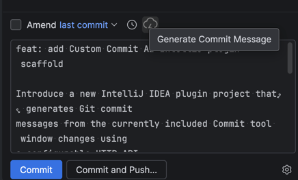
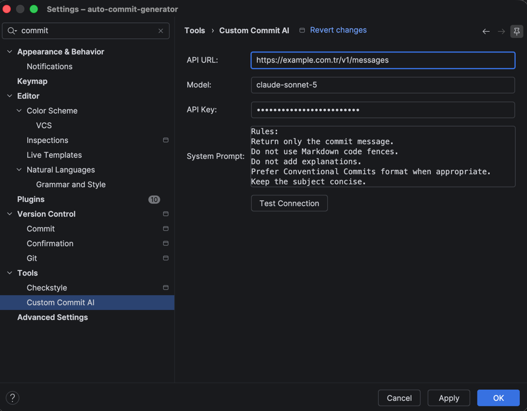

# Custom Commit AI

Minimal IntelliJ IDEA plugin that adds a small **Generate Commit Message** action to the Commit tool window. It reads only the changes currently included for commit, sends their textual diff to the configured HTTP endpoint, and replaces the commit-message field with the response. It never commits automatically.

## Configure

In **Settings | Tools | Custom Commit AI**, enter the API URL, model, optional API key, and system prompt. The key is stored in IntelliJ's Password Safe rather than in the persistent settings XML.

The client uses the same non-streaming request contract as the companion web UI:

```json
{
  "model": "your-model",
  "max_tokens": 256,
  "stream": false,
  "system": "...",
  "messages": [{ "role": "user", "content": "Generate a commit message..." }]
}
```

It sends `x-api-key` only when a key is configured, plus `anthropic-version: 2023-06-01`. The URL remains fully configurable. It parses the gateway's non-streaming message response and also accepts the conventional `choices[0].message.content` response shape.

## Build and run

```bash
bash ./gradlew buildPlugin
bash ./gradlew runIde
```

The project targets IntelliJ IDEA 2025.3.5 and Java 21. The action is registered in `ChangesView.CommitToolbar`, receives the active commit-message control, and reads `COMMIT_WORKFLOW_UI.includedChanges` plus `includedUnversionedFiles` at click time. This means a new message is generated from exactly the files currently checked for commit, never from unrelated working-tree changes.

### Screenshot

